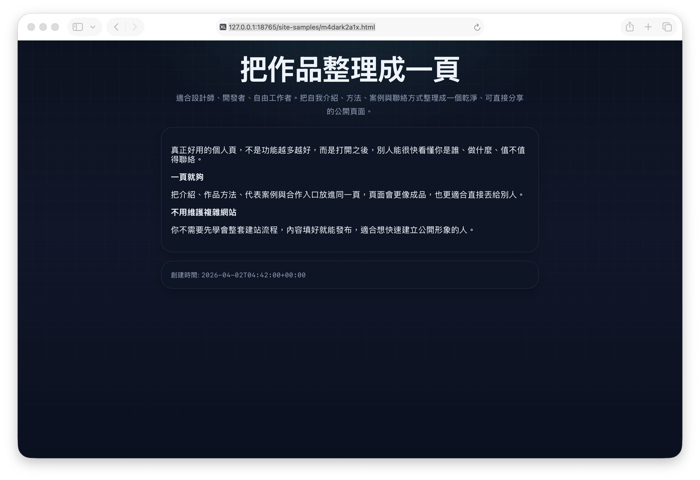

# xlog.ink

[](https://github.com/Lulu-Grant/xlog.ink/actions/workflows/tests.yml)


xlog.ink 是一个面向个人主页、作品页、文章页与公开资料页的轻量发布项目，当前正在实际使用：

- Live Site: https://xlog.ink
- GitHub Repo: https://github.com/Lulu-Grant/xlog.ink
- CI: GitHub Actions 自动运行基础测试

它提供：

- 多语言界面（繁中 / 简中 / English）
- 移动端优先样式
- 暗色 / 亮色主题切换
- 示例展示页
- 基于 PHP 的动态页面创建与生成能力

## 实际应用截图

### 首页


### 链接页示例


### 文章页示例



## 仓库定位

这个仓库是 **xlog.ink 的正式源码仓库**，用于保存：

- 前端页面与 UI 资源
- PHP 生成逻辑
- 站点公共模块
- 示例静态输出
- 持续迭代的版本记录

GitHub 仓库本身不承担生产运行环境职责；正式可用服务以 `https://xlog.ink` 为准。

## 项目结构

```text
assets/         样式、脚本、图片与第三方前端资源
includes/       PHP 公共函数、响应、i18n、限流等模块
partials/       可复用 HTML 片段
site/           运行时生成页面输出目录
site-samples/   仓库内保留的案例页面
index.html      首页
recent.html     最近生成页面展示
manual.html     使用说明页
creat.php       创建入口
creat-article.php
generate.php    页面生成入口
generate-article.php
build_recent.py recent.html 相关构建脚本
```

## 主要能力

### 1. 发布入口

项目提供首页、说明页、最近生成页面列表，以及创建入口页面，用于承接用户的页面创建流程。

### 2. 动态生成

通过 PHP 入口与公共模块，项目支持页面创建、文章页生成及相关响应流程。

### 3. 多语言与主题

内置多语言切换与暗/亮主题切换，适合面向不同语言用户访问。

### 4. 示例页面保留

仓库保留的案例页面已独立放入 `site-samples/`，而 `site/` 专门留给运行时生成内容，方便部署、备份和版本管理。

## 运行方式

这是一个包含 **PHP 动态功能** 的项目。

因此：

- GitHub：适合托管源码与版本记录
- 正式服务器：负责运行 PHP 动态逻辑
- 正式域名：`https://xlog.ink`

## 测试

仓库已提供一套轻量的零依赖测试，覆盖：

- PHP helper 与 Markdown 核心逻辑
- Turnstile 在未配置 secret 时的失败路径
- `build_recent.py` 的索引读取与输出排序
- PHP 内置服务器下的关键 HTTP smoke test
- GitHub Actions 中的自动测试执行

运行方式：

```bash
bash tests/run-tests.sh
```

CI 配置：

- `.github/workflows/tests.yml`

## 推荐部署方式

推荐使用：

- Nginx / Apache
- PHP 运行环境
- 可写目录权限（用于动态生成流程时，如有需要）
- 正式域名绑定到服务器
- 显式配置 `TURNSTILE_SITE_KEY` 与 `TURNSTILE_SECRET_KEY`

也就是说，**GitHub 是代码仓库，xlog.ink 才是实际在线服务**。

目前仓库已提供文档：

- [DEPLOY.md](DEPLOY.md)
- [CONFIG.md](CONFIG.md)
- [.env.example](.env.example)

## 仓库状态

- Visibility: Public
- Primary purpose: source control + project collaboration + release history
- Production entry: https://xlog.ink
