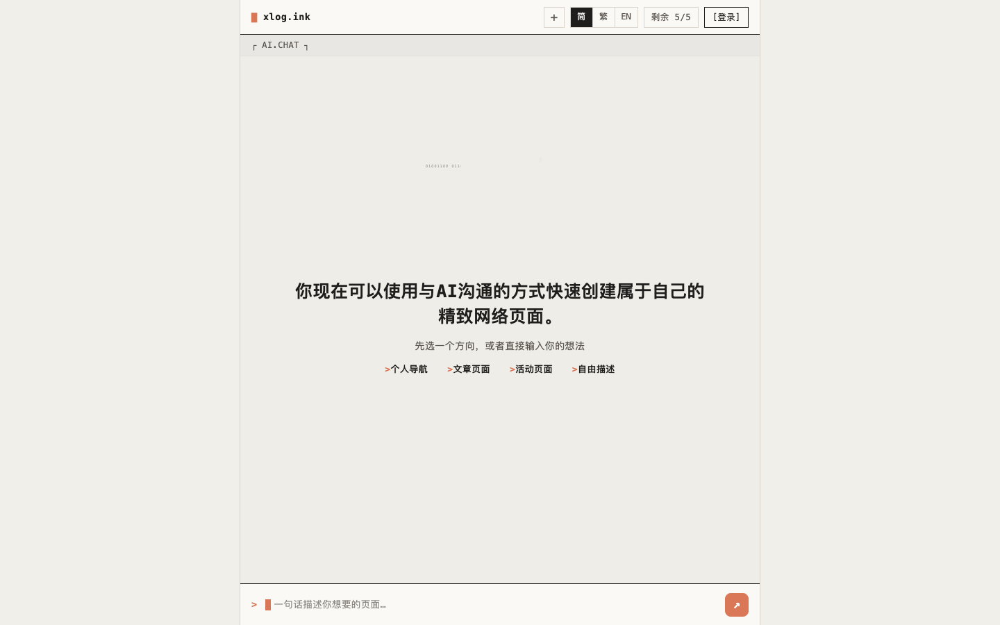
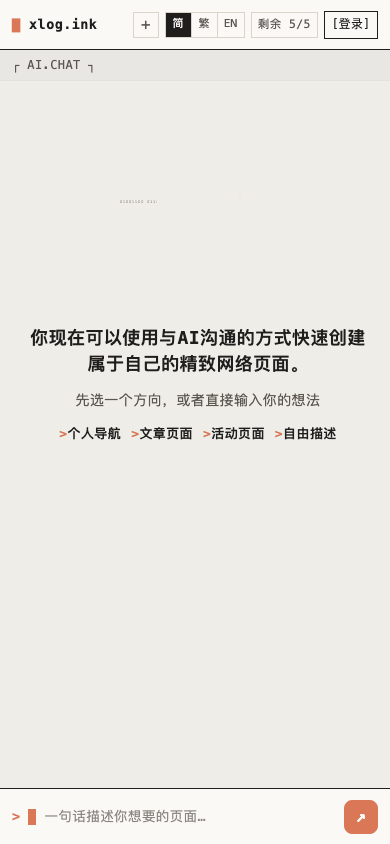
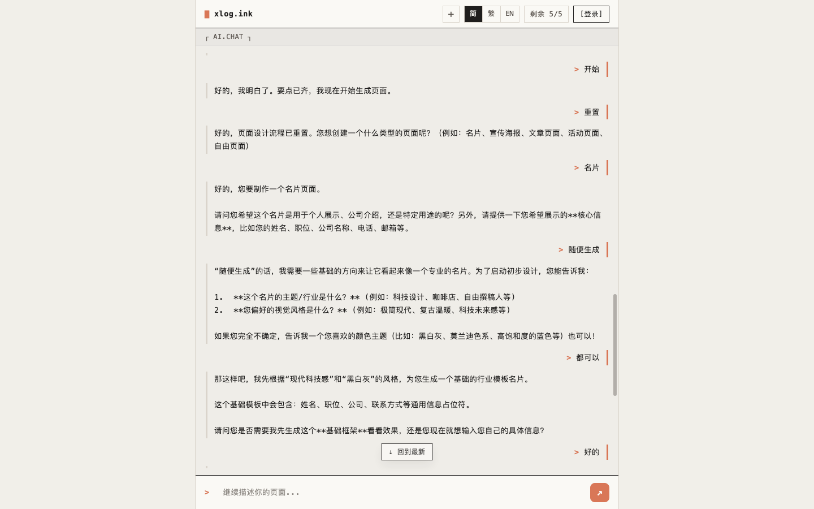
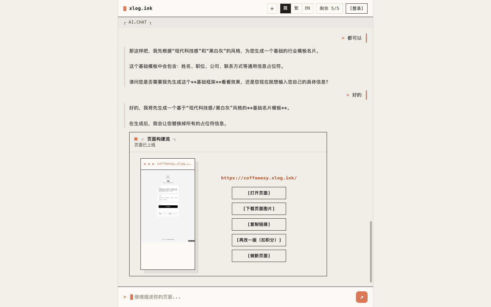
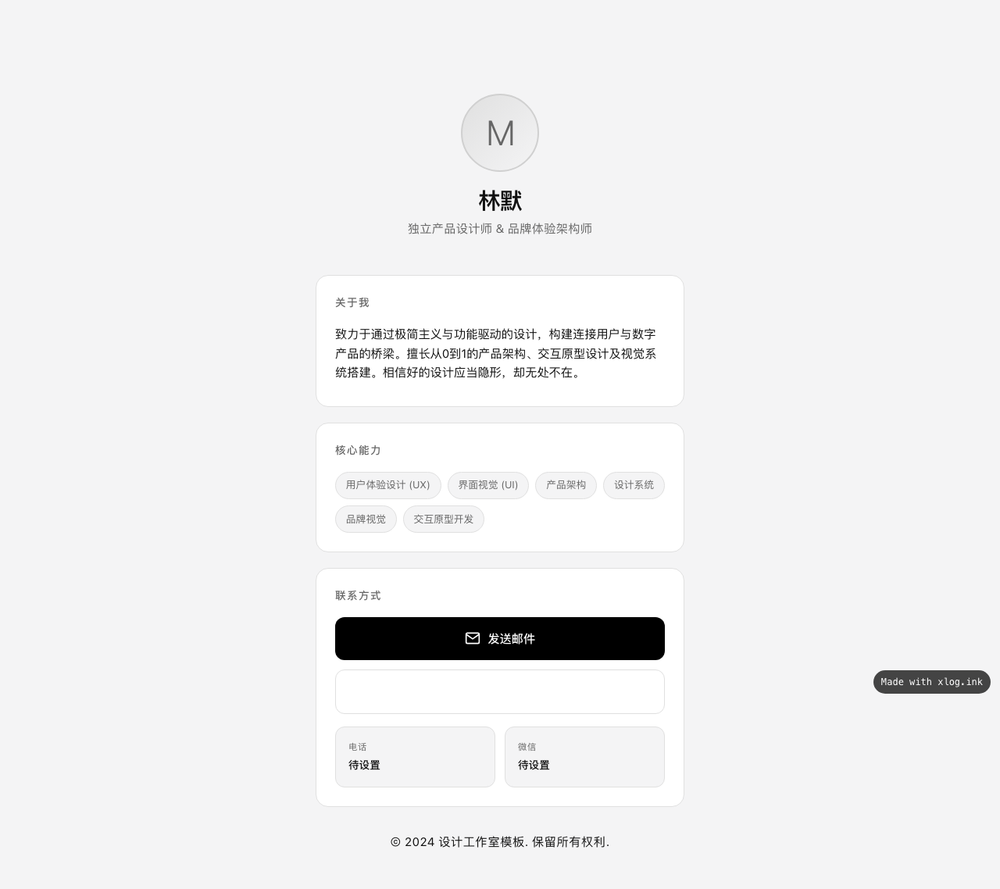
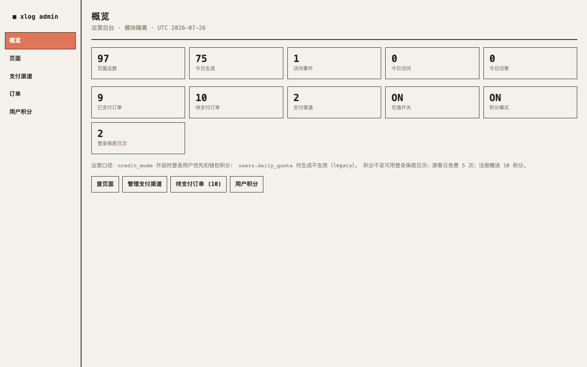
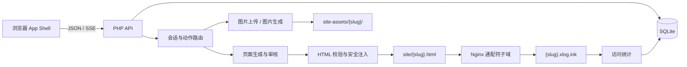
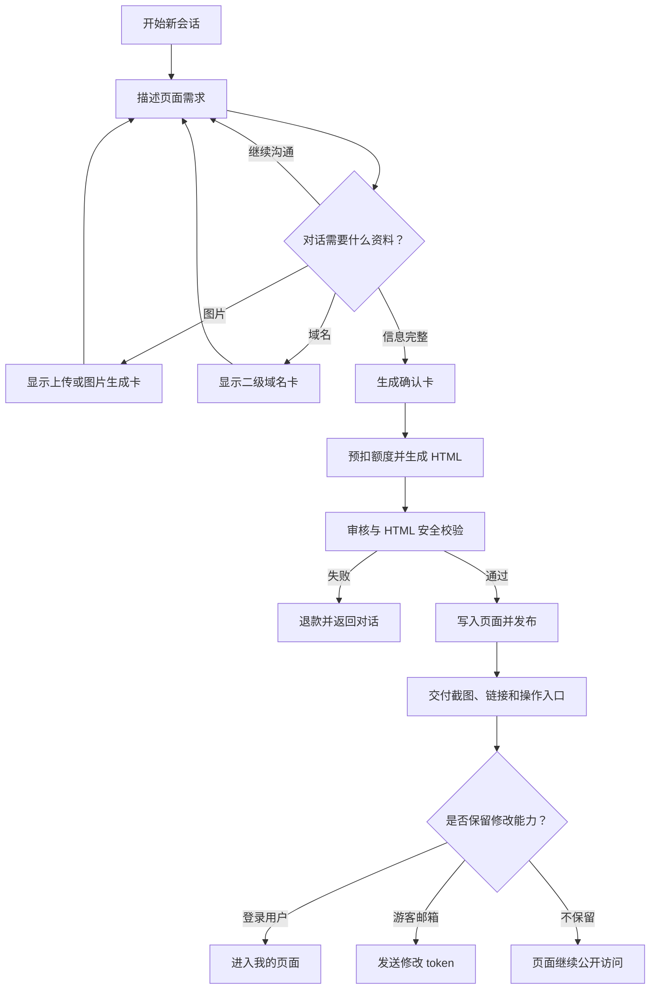

# xlog.ink

> 通过一段自然对话，把想法整理成可直接访问的独立网页。

[](https://www.php.net/)
[](https://www.sqlite.org/)
[](https://developer.mozilla.org/docs/Web/JavaScript)
[](https://xlog.ink)

**官网：[https://xlog.ink](https://xlog.ink)**

xlog.ink 是一个基于 PHP 8、SQLite、原生 JavaScript 和 Nginx 的聊天式网页生成与发布系统。用户在一个连续对话中描述页面内容、上传或生成图片、确认发布，系统会生成完整 HTML，并发布到独立的 `{slug}.xlog.ink` 二级域名。

固定头部、独立消息滚动区和固定输入框构成完整的 app shell；桌面端最大宽度为 750px，移动端直接适配可用视口。



## 产品界面

### 移动端

移动端保持单一聊天流，不增加复杂侧栏。语言、额度、登录和新会话入口集中在顶部，输入框始终位于当前可用视口底部。

<p align="center">
  
</p>

### 对话式需求整理

页面类型、文案、图片、域名、生成确认和邮箱修改入口都由对话语境触发。固定界面不堆放与当前步骤无关的表单。



### 页面交付

发布完成后，交付卡会在聊天流内显示整页截图缩略图、页面地址和操作按钮。用户可以打开页面、下载页面图片、复制链接、再次生成或开始新页面。



### 生成页面

生成结果是独立、完整的 HTML 页面，不依赖主站前端框架运行。页面通过通配符二级域名分发，并带有独立 SEO 信息、OG 图片、安全策略和访问统计像素。



### 运营后台

后台提供页面、访问、订单、积分用户和支付渠道等运营视图。截图中的数字来自本地测试数据，不代表线上实时数据。



## 核心能力

### 创建与发布

- 连续对话收集页面类型、内容、视觉风格和行动目标
- AI 动作协议触发上传、生成图片、域名、发布和邮箱卡片
- 用户明确要求时生成页面资料图
- JPG、PNG、WebP、GIF 上传后统一处理为 WebP
- 自动建议语义化二级域名前缀，并支持用户主动自定义
- 生成完整 HTML，写入 `site/{slug}.html`
- 发布到 `https://{slug}.xlog.ink/`
- 生成整页截图，用于交付卡、页面图片下载和 OG 图片
- 简体中文、繁体中文和英文界面

### 用户与编辑

- 游客可直接创建页面
- 邮箱验证码登录与注册
- 登录用户拥有独立积分和页面列表
- 游客可通过邮箱接收带鉴权 token 的修改链接
- owner 编辑和 token 编辑均在服务端二次校验
- 普通创建会话再次生成会创建新地址，不覆盖旧页面
- 新会话提供明确的重新开始边界

### 安全与防滥用

- 会话、聊天、上传、验证码、生成和访问统计限频
- 生成前预扣额度，失败、拒绝或校验失败自动退款
- 成人内容由 AI 审核文字和图片，不使用关键词规则判定
- 生成 HTML 拒绝脚本、iframe、form、事件属性和危险外链
- 生成页使用严格 CSP，默认禁止脚本和网络请求
- 主域、生成页子域和上传资源使用独立 Nginx 边界
- 后台使用独立 token、CSRF 和登录失败锁定
- 支付回调校验渠道、签名、金额和订单状态，并保证幂等入账

### 运营与维护

- 页面和访问数据统计
- 页面、订单、支付渠道和用户积分管理
- SQLite schema 初始化和版本迁移
- recent 页面与 sitemap 构建
- 历史页面风险批量扫描与 CSV 报告
- 临时资源、过期会话、邮件事件和访问事件清理
- 配置诊断、成本报表和多组回归脚本

## 系统结构


```mermaid
flowchart LR
    B["浏览器 App Shell"] -->|"JSON / SSE"| A["PHP API"]
    A --> C["会话与动作路由"]
    C --> G["页面生成与审核"]
    C --> U["图片上传 / 图片生成"]
    A --> D[("SQLite")]
    G --> H["HTML 校验与安全注入"]
    H --> S["site/{slug}.html"]
    U --> R["site-assets/{slug}/"]
    S --> N["Nginx 通配符子域"]
    N --> P["{slug}.xlog.ink"]
    P --> V["访问统计"]
    V --> D
```

## 用户流程


```mermaid
flowchart TD
    A["开始新会话"] --> B["描述页面需求"]
    B --> C{"对话需要什么资料？"}
    C -->|"图片"| D["显示上传或图片生成卡"]
    C -->|"域名"| E["显示二级域名卡"]
    C -->|"继续沟通"| B
    D --> B
    E --> B
    C -->|"信息完整"| F["生成确认卡"]
    F --> G["预扣额度并生成 HTML"]
    G --> H["审核与 HTML 安全校验"]
    H -->|"失败"| I["退款并返回对话"]
    H -->|"通过"| J["写入页面并发布"]
    J --> K["交付截图、链接和操作入口"]
    K --> L{"是否保留修改能力？"}
    L -->|"登录用户"| M["进入我的页面"]
    L -->|"游客邮箱"| N["发送修改 token"]
    L -->|"不保留"| O["页面继续公开访问"]
```

## 技术栈

| 层级 | 实现 |
|---|---|
| Web | PHP 8、原生 JavaScript、原生 CSS |
| 数据 | SQLite、WAL、版本迁移 |
| 实时响应 | `fetch()` 流式读取、SSE 事件 |
| 图片 | GD、WebP、整页截图 |
| 邮件 | SMTP |
| 网关 | Nginx、通配符二级域名、CSP |
| 运行方式 | 单机 PHP-FPM，也可扩展到独立服务 |

项目不依赖前端构建步骤，服务端和浏览器资源可以直接部署。

## 关键目录

```text
api/                 JSON / SSE 接口
assets/              品牌、动画、OG 和兼容资源
css/                 App shell 与动作卡样式
data/                SQLite、日志和报告等运行时数据
docs/                架构、部署、审计和产品文档
includes/            数据库、AI、审核、额度、支付、邮件等模块
js/                  聊天、动作卡、交付和账户交互
migrations/          版本化数据库迁移
partials/            后台和页面 PHP partial
prompts/             对话与页面生成规则
scripts/             部署、诊断、测试、清理和报表脚本
site/                已发布 HTML 页面
site-assets/         上传图片、生成图片和页面截图
```

## 本地运行

### 环境要求

- PHP 8.0+
- PDO SQLite
- GD
- cURL
- mbstring
- Node.js，仅在生成整页截图时需要

### 启动

```bash
git clone https://github.com/Lulu-Grant/xlog.ink.git
cd xlog.ink
php -S 127.0.0.1:8097 -t .
```

浏览器打开：

```text
http://127.0.0.1:8097/
```

没有生产运行配置时，仍可启动界面并使用本地开发流程。真实凭据不得写入仓库。

## 生产配置

以示例文件为基础，在 webroot 外创建运行配置：

```bash
sudo mkdir -p /etc/xlog
sudo cp docs/config.example.php /etc/xlog/config.php
sudo chmod 600 /etc/xlog/config.php
```

部署前执行：

```bash
php scripts/diagnose-config.php
php scripts/migrate-jsonl.php
php scripts/build-recent.php
php scripts/build-sitemap.php
```

完整 Nginx 参考配置：

```text
docs/nginx-xlog.ink.prod.conf
```

主域必须屏蔽内部目录和部署文件：

```nginx
location ~ ^/(?:data|includes|prompts|scripts|docs|migrations|partials)(?:/|$) {
    return 404;
}

location = /deploy.example.env {
    return 404;
}

location ~ /\.(?!well-known) {
    return 404;
}
```

通配符子域只应提供生成页面和必要静态资源，不应暴露主站 API、后台或 PHP 文件。

## 部署

仓库提供代码同步脚本。它会排除数据库、生成页和上传资源，并在远端修正运行目录权限：

```bash
scripts/deploy-code.sh
```

可以通过环境变量指定目标服务器：

```bash
XLOG_DEPLOY_REMOTE=root@example.com \
XLOG_DEPLOY_DEST=/www/wwwroot/xlog.ink \
XLOG_DEPLOY_KEY=/path/to/key \
scripts/deploy-code.sh
```

不要直接使用会保留本机属主的 `rsync -a` 覆盖生产目录，否则 SQLite 和上传目录可能变成不可写。

## 测试

### PHP 与 JavaScript 语法

```bash
find . -name '*.php' -not -path './vendor/*' -print0 | xargs -0 -n1 php -l
node --check js/ai-app.js
node --check scripts/capture-page.js
```

### 回归脚本

```bash
for test in scripts/test-*.php; do
  php "$test"
done
```

### 诊断与运维

```bash
php scripts/diagnose-config.php
php scripts/cost-report.php
php scripts/cleanup-tmp-assets.php
php scripts/audit-page-risk.php
```

最新完整审计见：

- [第九轮综合复审](docs/AUDIT-9-2026-07-26.md)
- [文档索引](docs/README.md)

## 主要 API

<details>
<summary>会话、聊天与发布</summary>

- `POST /api/session.php`
- `POST /api/chat.php`
- `POST /api/upload.php`
- `POST /api/image-generate.php`
- `POST /api/domain-check.php`
- `POST /api/publish.php`
- `POST /api/page-email.php`
- `POST /api/resend-edit.php`

</details>

<details>
<summary>账户与页面</summary>

- `POST /api/auth/send-code.php`
- `POST /api/auth/verify.php`
- `POST /api/auth/logout.php`
- `POST /api/auth/me.php`
- `POST /api/my-pages.php`
- `POST /api/edit-session.php`

</details>

<details>
<summary>积分与支付</summary>

- `POST /api/pay/packages.php`
- `POST /api/pay/create.php`
- `POST /api/pay/status.php`
- `GET|POST /api/pay/notify.php`
- `GET|POST /api/pay/return.php`

</details>

## 仓库边界

以下内容不会进入 Git：

- `/etc/xlog/config.php` 和任何真实凭据
- SQLite 数据库及 WAL/SHM 文件
- 邮件日志和本机诊断输出
- `site/*.html` 生成页
- `site-assets/*` 上传图片与页面截图
- 临时预览、限流数据和系统文件

`docs/screenshots/` 只保存用于说明当前产品界面的脱敏本地截图。
